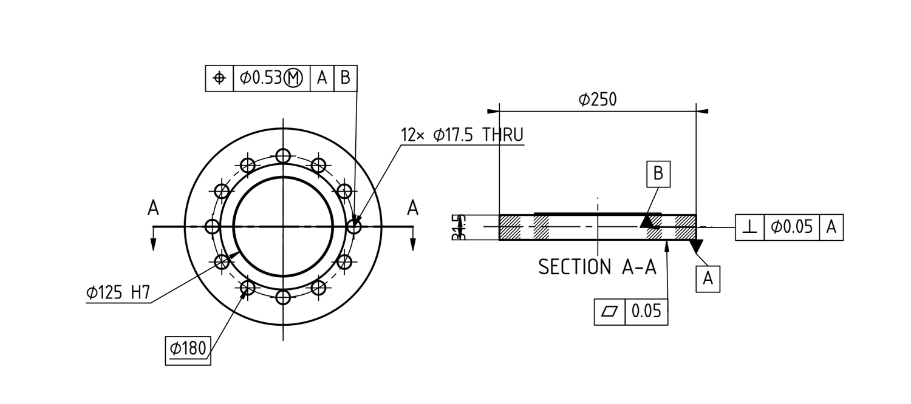
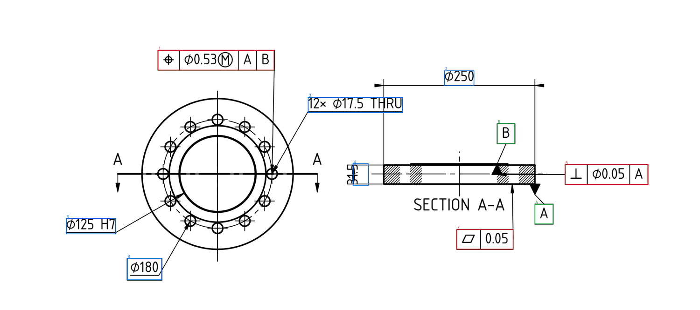
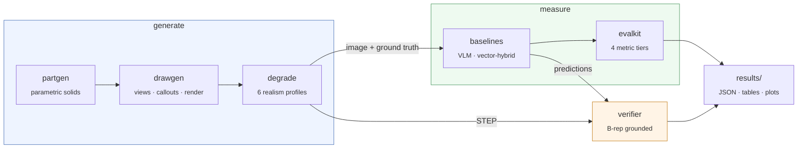
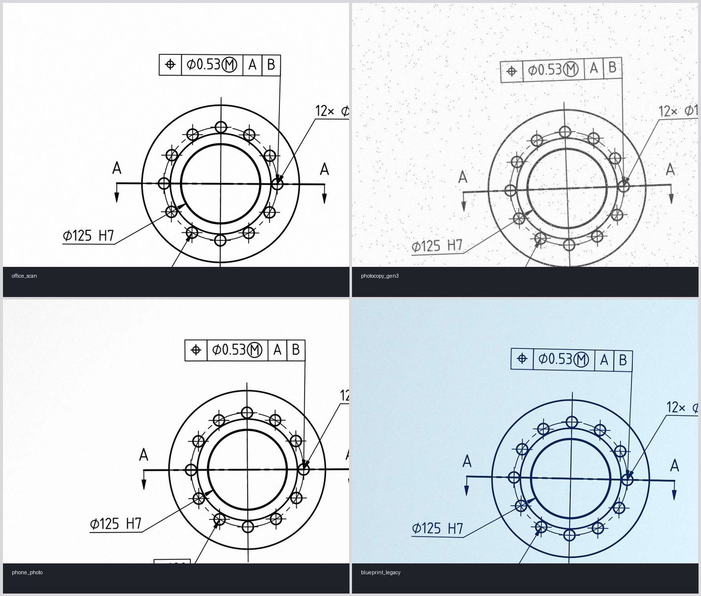

<div align="center">

# ⬤ BalloonBench

**A synthetic-first benchmark, evaluation harness and geometry-grounded verifier
for reading GD&T off 2D engineering drawings.**

[](https://www.python.org/)
[](LICENSE)
[](https://github.com/CadQuery/OCP)
[](tests/)
[](tests/)

</div>

<p align="center">
  
</p>

<div align="center"><sub>
Not a screenshot of someone else's drawing. This sheet, its solid, and every bounding box on
it were generated by this repository from the seed <code>flange&nbsp;#5</code>.
</sub></div>

---

## 🎯 The problem

Before a machined part can be quoted, inspected or approved, a quality engineer reads every
dimension and geometric tolerance off a 2D drawing, numbers them — *ballooning* — and
transcribes them into an inspection plan. It is slow, error-prone, and done by hand at
thousands of firms. The drawings are PDFs, and often scans of scans.

Extraction models exist. What does not exist is a way to know whether one works:

|  | The gap |
|---|---|
| 📏 **No benchmark** | Every published result uses a private set of drawings. Nothing is comparable. |
| 🧩 **No structural metric** | A model can read every value correctly and wire every tolerance to the wrong datum. Per-characteristic accuracy cannot see it. |
| 🔍 **No grounding** | Nothing checks the extraction against the *part*. A ⌀22 misread as ⌀20 is a plausible number on a plausible drawing. |

BalloonBench is all three: a generator with exact ground truth, metrics that map to what a
quality engineer audits, and a verifier that checks a drawing against the solid it describes.

---

## 📥 Input → 📤 Output

The generator emits a drawing **and** the answer key, together, from one seed.

<p align="center">
  
</p>

<div align="center"><sub>
🟦 dimensions &nbsp;·&nbsp; 🟥 geometric tolerances &nbsp;·&nbsp; 🟩 datum features
</sub></div>

Boxes are computed when the callout is *placed* and transformed into pixels by the same
transform the rasteriser uses. They are never recovered from rendered pixels, so they cannot
drift from what is drawn.

```jsonc
{
  "drawing_id": "flange-00005",
  "units": "mm",  "projection": "third_angle",
  "image_size": [2339, 1654],
  "sheet": { "size": "A4", "scale": "1:5" },

  "datums": [
    { "label": "A", "feature_type": "planar_face",
      "bbox": [1720.5, 748.2, 1768.2, 800.6], "geometry_ref": "mounting_face" }
  ],

  "characteristics": [
    { "id": 1, "kind": "geometric_tolerance", "view": "front",
      "bbox": [738.4, 346.0, 1041.9, 398.4],
      "gtol_symbol": "position",  "gtol_value": 0.53,
      "gtol_zone": "diametral",   "material_modifier": "MMC",
      "datum_refs": [{ "label": "A" }, { "label": "B" }],
      "raw_text": "⌖|⌀0.53Ⓜ|A|B" },

    { "id": 6, "kind": "dimension", "view": "front",
      "bbox": [499.1, 786.0, 628.7, 826.7],
      "leader_target_bbox": [795.3, 570.9, 992.1, 767.7],
      "dim_type": "diameter", "nominal": 125.0,
      "upper_tol": 0.04, "lower_tol": 0.0,
      "tol_style": "fit", "fit_class": "H7",
      "raw_text": "⌀125 H7" }
  ]
}
```

Six artifacts per drawing: vector **PDF**, **PNG** at any DPI, **DXF**, the **STEP** solid,
the ground-truth **JSON**, and a QA **overlay** like the one above.

---

## ⚡ Quickstart

```bash
conda create -y -n balloonbench python=3.12
conda activate balloonbench
pip install -e ".[dev,vision]"

python scripts/check_env.py     # must print "ok" before anything else
pytest                          # 815 tests, ~4 minutes
```

```bash
balloonbench draw flange -n 5 --dpi 300          # drawings + ground truth
balloonbench degrade data/drawings/**/*.png -p all   # six realism conditions
balloonbench predict vector_hybrid --gt data/drawings --model claude-opus-5
balloonbench evaluate preds/*.json --gt data/drawings --out results/run-1
balloonbench verify data/drawings/**/*.json      # check against the solid
```

---

## 🔧 How it fits together



| Module | What it does |
|---|---|
| 🔩 **`partgen`** | Five part families built from sampled parameters, so ground truth is exact rather than inferred. Every solid is validated before export and resampled on failure. ISO 286 fits are computed, not guessed. |
| 📐 **`drawgen`** | Hidden-line projection through OpenCASCADE, view layout, section views, anchor-from-feature callout placement with collision scoring, GD&T symbols, title block, five house styles. |
| 🌫️ **`degrade`** | Six named conditions from `clean` to `photocopy_gen3`. Every geometric warp moves the bounding boxes through the same transform as the pixels. |
| 📊 **`evalkit`** | Hungarian matching, then four metric tiers: detection, correctness, structure, cost. |
| 🤖 **`baselines`** | Zero-shot and structured VLM, plus a vector-hybrid that parses the PDF's own text with a recursive-descent grammar. |
| 🔍 **`verifier`** | B-rep index over the STEP solid; five checks decide *verified*, *contradicted* or *unverifiable*. |

---

## 🌫️ Six ways a drawing reaches you

A benchmark that only tests clean vector PDFs tests the easy half of the problem. Each
profile is an ordered list of seeded transforms telling a physical story — paper is marked
and creased *before* it is copied; a phone photo has a lens and a room light but no toner
streak.

<p align="center">
  
</p>

`clean` · `office_scan` · `scan_heavy` · `photocopy_gen3` · `phone_photo` · `blueprint_legacy`

The ground truth is degraded **with** the image and never shared with the clean version. A
callout warped off the sheet is dropped rather than clamped, because a clamped box points at
a region where the callout is not. A profile plus a seed reproduces a sample exactly.

---

## 📊 What is measured

### Four tiers, because one number hides the failure that matters

| Tier | Question | Metrics |
|---|---|---|
| 1️⃣ **Detection** | Did it find the callout? | precision / recall / F1, by kind and by GD&T symbol |
| 2️⃣ **Correctness** | Having found it, did it read it right? | nominal, tolerance exact and within 1 LSD, symbol, **modifier**, ordered datum refs |
| 3️⃣ **Structure** | Is the drawing wired together correctly? | datum graph edit distance, full-drawing exact match |
| 4️⃣ **Cost** | What would the errors have cost? | CTQ recall, weighted error total |

Tier 3 exists because a model can score perfectly on tiers 1 and 2 and still attach every
tolerance to the wrong reference frame — invisible per characteristic, catastrophic in
practice. Weights for tier 4 live in
[`error_costs.json`](balloonbench/evalkit/error_costs.json) with a written justification for
each. → [`docs/metrics.md`](docs/metrics.md)

### Baseline: reading a native PDF with no model at all

`vector_hybrid` extracts the PDF's text, clusters it geometrically, and parses it with a
grammar gated on a **323-string corpus**. Only what will not parse is sent to a model.

| Family | Precision | Recall | F1 |
|---|---:|---:|---:|
| flange | 0.97 | 0.78 | 0.87 |
| housing | 1.00 | 0.69 | 0.82 |
| plate_bracket | 0.98 | 0.90 | 0.94 |
| shaft | 1.00 | 0.88 | 0.94 |
| valve_body | 1.00 | 0.77 | 0.87 |
| **overall** | **0.99** | **0.82** | **0.90** |

On a scan it returns nothing, and says so. That zero is the finding: routing on input type
matters more than model choice.

### Verifier: checking the drawing against the part

Given a STEP file and a list of characteristics, decide for each whether the geometry agrees
— a question that needs no ground truth, which is what makes it usable on a customer's own
drawings.

> **A verifier that flags correct extractions is worse than no verifier.**
> Everything in the module trades recall for precision on purpose.

<table>
<tr><td>

**False positives on correct ground truth**

</td><td align="right">

**1.3 %** <sub>(gate: 5 %)</sub>

</td></tr>
<tr><td>Misread nominal caught</td><td align="right">82 %</td></tr>
<tr><td>Frame stripped to one datum</td><td align="right">100 %</td></tr>
<tr><td>Reference to an undeclared datum</td><td align="right">100 %</td></tr>
<tr><td>Whole sheet in the wrong unit</td><td align="right">100 %</td></tr>
<tr><td>Datum swaps · reordered frames · dropped callouts</td><td align="right"><sub>undetectable by geometry</sub></td></tr>
</table>

That last row is proved, not claimed: an injected error is labelled undetectable only when
the verifier's own sufficiency rule says both the original and the damaged reference frame
constrain the part adequately — so the damaged drawing is still satisfiable by the solid.
Catching those is tier 3's job, which has ground truth to compare against.
→ [`docs/verifier.md`](docs/verifier.md)

```console
$ balloonbench verify data/drawings/flange/flange-00005.json
 ok  flange-00005   5 verified, 0 contradicted, 3 unverifiable, 0 drawing defects
```

The **unverifiable** bucket is not a failure bucket. It names the characteristics that need
a person, which is what makes the output usable somewhere a bare confidence score is not.

---

## 🗺️ Status

| Milestone | State |
|---|---|
| **M0** environment, frozen schema, CI | ✅ done |
| **M1** `partgen` — 5 part families | ✅ done |
| **M2** `drawgen` — projection, layout, annotation, render | ✅ done |
| **M3** `degrade` — 6 realism profiles | ✅ done |
| **M4** `evalkit` — matching + 4 metric tiers | ✅ done |
| **M5** VLM baselines — zero-shot + structured | ✅ harness done · paid run pending |
| **M6** callout grammar + vector-hybrid baseline | ✅ done |
| **M7** `verifier` — B-rep index + 5 checks | ✅ done |
| **M8** 50 hand-labelled real drawings | ⬜ next |
| **M9** DETR + OCR detector baseline | ⬜ not started |
| **M10** demo · **M11** write-up | ⬜ not started |

Each milestone ends at an acceptance gate and the next does not start until it is green.
The gates are tests, not intentions: `pytest -m slow` runs all twelve.

---

## 🧭 Principles the code actually follows

- **Ground truth is computed, never recovered.** Bounding boxes come from the placement pass
  and are transformed by the same code the rasteriser uses.
- **A seed reproduces a drawing exactly.** All randomness flows from one recorded seed.
- **Refuse rather than guess.** The grammar raises on an ambiguous string; the verifier says
  *unverifiable*; the sampler rejects and resamples rather than clamping a parameter.
- **Every threshold is justified where it is defined.** If a constant has a value, the file
  says why it has that value and what went wrong at the other one.
- **Say what was not measured.** Undetectable errors are reported as undetectable.

---

## 📋 Scope

### In scope (v1)

Rotational parts, flanges, plates and brackets, simple prismatic housings, and simplified
valve bodies. Linear, diameter, radius, angular and chamfer dimensions; bilateral,
unilateral, limit and ISO-fit tolerances; thread callouts; surface finish symbols. Geometric
tolerances covering form (flatness, straightness, circularity, cylindricity), orientation
(perpendicularity, parallelism, angularity), location (position, concentricity, symmetry),
runout (circular, total) and profile of a surface. Feature control frames with up to three
datum references, MMC/LMC/RFS material condition modifiers, datum feature symbols, title and
revision blocks. Orthographic, section, detail and isometric-inset views, in both first- and
third-angle projection.

### Explicitly out of scope (v1)

A narrow benchmark that has been validated beats a broad one that has not. The following are
**not** covered, and this list is binding:

composite feature control frames · profile of a line · tangent plane · free state ·
statistical tolerance · datum targets · weld symbols · assembly drawings · BOM tables ·
exploded views · sheet metal flat patterns and bend tables · non-English drawings ·
hand-sketched drawings

---

## 📁 Layout

```
balloonbench/
├── schema.py            # the ground-truth contract; every module reads and writes it
├── partgen/             # parametric solids + ISO 286 fits
├── drawgen/             # projection, layout, annotation, symbols, render
├── degrade/             # 6 seeded realism profiles
├── evalkit/             # matching, 4 metric tiers, reporting
├── baselines/           # VLM, vector-hybrid, callout grammar
└── verifier/            # B-rep index + 5 geometric checks
assets/fonts/            # vendored, with licences — never a system font
docs/                    # metrics.md · verifier.md · findings.md
tests/                   # 815 tests, 12 acceptance gates
```

---

## ⚖️ Licensing

The repository is **Apache-2.0**. Three constraints are handled deliberately rather than
inherited by accident:

- **PyMuPDF** is AGPL-3.0 and is isolated behind the optional extra `balloonbench[agpl]`.
  Nothing under `balloonbench/` imports it; rasterisation uses `pypdfium2` (BSD-3) and
  vector extraction uses `pdfplumber` (MIT), and `check_env.py` fails if the import ever
  appears.
- **Ultralytics YOLO** is AGPL-3.0 and is not used. The detector baseline is HuggingFace
  `DetrForObjectDetection` (Apache-2.0).
- **osifont** is vendored under LGPL-3.0 *with the GPL font exception*, and the exception is
  the point: the PDFs and PNGs generated here do not inherit the font's licence just by
  embedding it, so the dataset can be distributed on its own terms. Handwriting in the
  degradation profiles uses **Caveat** (OFL-1.1). Both carry provenance and licence texts in
  `assets/fonts/`.

ASME Y14.5 and ISO 1101 are copyrighted standards. BalloonBench implements the *conventions*
they describe — conventions are not copyrightable — but reproduces no text, table or figure
from either. Every rule is described in our own words.

The real-drawing split will carry a `manifest.yaml` recording source URL, licence, retrieval
date and any redaction for every sheet, so anyone can verify the right to distribute it.
